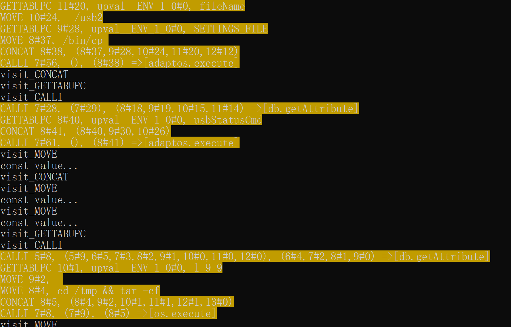

# lua-checker
custom IR recompiler with model checker for hunting lua vulnerabilities

## limitation
*  cannot handle with some modified versions

## support list
* `lua 5.1`
* `lua 5.2`
* `lua 5.3`
* openwrt version
* elua version

## requirement
* require `python3`
* `pip3 install termcolor`

## api
* `ExecuteLuaCheck`

## usage
* `python3 ./LuaChecker.py -i inputname`

## possible vulnerabilities in REAL WORLD
* see `testcase/system_actions_raw.lua`

